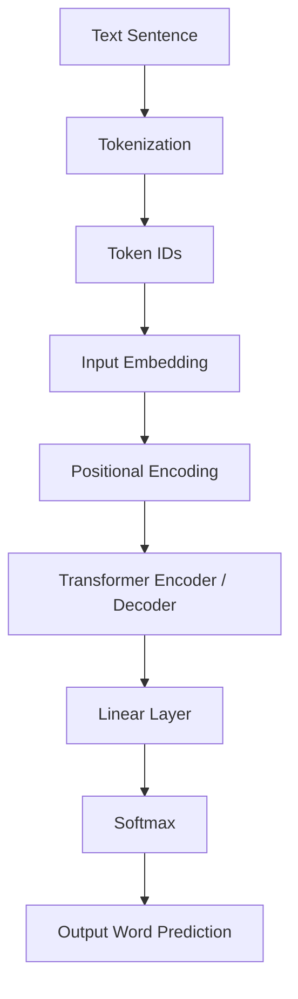
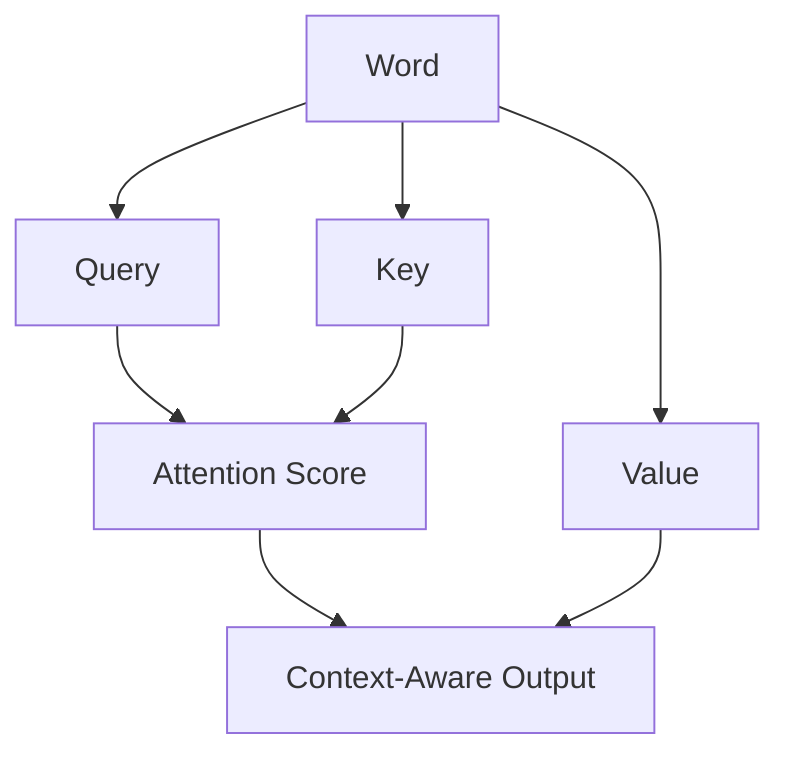
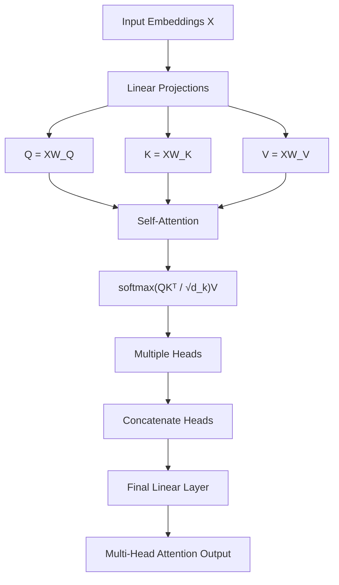

Modern AI systems like ChatGPT, Google Translate, and GPT models are all powered by a revolutionary architecture: **Transformers**.

But before Transformers, models like RNNs and LSTMs struggled with long sentences, slow training, and memory limitations. Transformers solved these problems using a powerful idea called **Self-Attention**.

### The Famous Paper
Transformers were introduced in the landmark 2017 paper **"Attention Is All You Need"** by researchers at Google. This architecture completely shifted the landscape of Natural Language Processing (NLP).

---

### Why Transformers? (RNN/LSTM vs. Transformer)

To understand why Transformers are so powerful, we first need to look at what they replaced. Traditional models like RNNs and LSTMs processed text one word at a time (sequentially), which led to several bottlenecks.

| Feature | RNN / LSTM | Transformer |
| :--- | :--- | :--- |
| **Processing Speed** | Sequential (Slow) | Parallel (Fast) |
| **Long Sentences** | Hard to remember context | Self-Attention connects all words |
| **Memory** | Compressed hidden state | Dynamic Attention scores |
| **Training** | Vanishing Gradients (Unstable) | Stable & Scalable |
| **Scalability** | Difficult to scale | Scales to huge datasets |

---

### Problems Solved by Transformers

#### 1. Processing Speed
RNNs process words one after another. If you have a sentence with 100 words, the model must wait for word 1 to finish before moving to word 2. 
**The Solution:** Transformers process all words in a sequence **at the same time** using attention matrices. This parallel processing makes training much faster.

#### 2. Long-Range Dependency (The Context Problem)
In a long sentence, traditional models often "forget" the beginning by the time they reach the end.
*   **Example:** *"The book that I bought yesterday from the new store is amazing."*
*   **The Issue:** An RNN might lose the connection between "book" and "amazing." 
*   **The Solution:** Transformers use Self-Attention to allow every word to "look at" every other word directly. The model understands that **"book"** is the thing that is **"amazing."**

#### 3. Memory Bottleneck
RNNs try to compress an entire sentence into a single "hidden state" vector. This means important details can easily be lost in the compression.
**The Solution:** Transformers don't compress everything into one state. Instead, they use attention scores to dynamically focus on relevant words for the current task.

#### 4. Training Instability
RNNs suffer from vanishing and exploding gradients, making them hard to train on very long sequences.
**The Solution:** Transformers remove recurrence completely and rely on attention and feed-forward layers, making training significantly more stable.

---
### The Transformer Pipeline: From Text to Prediction

Before we dive into the math, let's look at the high-level process of how a Transformer handles a sentence:




*Figure 1: The Transformer - model architecture.*

---

### Tokenization in Transformers
{: .technical-heading }

**What is Tokenization?**
Tokenization is the process of breaking raw text into smaller units called **tokens** so that a machine learning model can process them. Computers cannot directly understand words or sentences—they work with numbers. Therefore, text must first be split and converted into tokens.

*   **Example Sentence:** *"Transformers are powerful models"*
*   **After Tokenization:** `["Transformers", "are", "powerful", "models"]`

Each token is then converted into numerical IDs from the model's vocabulary.

**Why Tokenization is Important**
1.  **Neural networks cannot read raw text:** They require numerical input.
2.  **Language Structure:** It helps the model understand the building blocks of a sentence.
3.  **Efficiency:** It allows models like BERT and GPT to process vast amounts of text efficiently.

**Example of the Process:**
*   **Sentence:** *"I love machine learning"*
*   **Step 1 — Tokenization:** `["I", "love", "machine", "learning"]`
*   **Step 2 — Token IDs:** `[17, 235, 984, 652]`

---

### Input Embedding in Transformers
{: .technical-heading }

**What is Input Embedding?**
Input Embedding is the process of converting token IDs into **dense numerical vectors** so that the Transformer model can understand the meaning of words. After tokenization, words become numbers (token IDs), but neural networks work much better with vectors that capture semantic relationships.

**Example Process ("I love AI"):**
1.  **Tokenization:** `["I", "love", "AI"]`
2.  **Token IDs:** `[15, 289, 910]`
3.  **Input Embedding:** Each ID is converted into a high-dimensional vector.

| Token | Token ID | Embedding Vector (Simplified) |
| :--- | :--- | :--- |
| **I** | 15 | `[0.12, -0.44, 0.81, ...]` |
| **love** | 289 | `[0.65, 0.13, -0.72, ...]` |
| **AI** | 910 | `[-0.22, 0.91, 0.34, ...]` |

In real models, these vectors can have dimensions like **512, 768, 1024, or even 4096+**.

**Why Input Embedding is Important**
Input embeddings allow the model to capture **semantic relationships** between words. A famous example is:
> **king − man + woman ≈ queen**

Words with similar meanings (like "dog" and "puppy" or "car" and "vehicle") will have vectors that are numerically "close" to each other in this high-dimensional space.

**The Embedding Matrix**
The model uses a massive **Embedding Matrix** (e.g., 50,000 words × 512 dimensions). When a token ID enters the layer, the model simply looks up the corresponding row in this matrix to get its vector.

**Input Embedding + Positional Encoding**
Because Transformers process all words at once (in parallel), they naturally don't know the order of words. To fix this, the model adds **Positional Encoding** to the Input Embedding:
> **Final Input = Token Embedding + Positional Encoding**

This gives the model both the **meaning** of the word and its **position** in the sentence.

---

### Positional Encoding in Transformers
{: .technical-heading }

**What is Positional Encoding?**
Positional Encoding is a technique used in Transformers to add information about the **position** of each word in a sentence. Because Transformers process all words at the same time (in parallel), the model does not naturally know the order of words. 

Positional encoding tells the model:
*   Which word comes first
*   Which word comes second
*   The relative distance between words

**Why Positional Encoding is Needed**
Consider these two sentences:
1.  *"man walks on river bank"*
2.  *"man withdraws money from bank"*

Both sentences contain the same words, but the meaning is completely different. Without positional information, a Transformer would treat them almost the same (like a "bag of words"). Positional encoding solves this by adding specific position information to the word embeddings.

**How it Works: The Sinusoidal Approach**
The original Transformer paper used **sinusoidal (wave-like) functions** to generate unique position values. This allows the model to learn relative distances between words and handle sequences longer than those seen during training.

**The Formulas:**
- For even dimensions ($2i$): 
  $$PE_{(pos, 2i)} = \sin\left(\frac{pos}{10000^{2i/d_{model}}}\right)$$
- For odd dimensions ($2i+1$): 
  $$PE_{(pos, 2i+1)} = \cos\left(\frac{pos}{10000^{2i/d_{model}}}\right)$$

*Where:*
- **pos:** The position of the token in the sequence.
- **i:** The dimension index.
- **d_model:** The total number of dimensions in the embedding (e.g., 512).

**The Simple Calculation:**
> **Final Input Vector = Word Embedding Vector + Positional Encoding Vector**

---

*   **Example Process ("I love AI"):**
    *   **"I"** → Word Embedding `[0.2, 0.1, 0.7]` + Position 1 Vector `[0.01, 0.02, 0.03]`
    *   **"love"** → Word Embedding `[0.8, 0.4, 0.3]` + Position 2 Vector `[0.04, 0.05, 0.06]`
    *   **"AI"** → Word Embedding `[0.6, 0.9, 0.5]` + Position 3 Vector `[0.07, 0.08, 0.09]`

This allows the model to know both the **meaning** (from the embedding) and the **location** (from the encoding) of every word.

---

### Deep Dive: How Self-Attention Works
{: .technical-heading }

Self-Attention is the mechanism that allows a model to analyze the relationship between words in a sequence. Think of it as a way for each word to ask: *"How much attention should I give to every other word to understand my own context?"*

#### Why Self-Attention is Powerful
Based on the core principles of Transformers, Self-Attention provides three main advantages:
*   **Captures Long-Range Relationships:** Unlike RNNs, distance between words doesn't matter. Every word can "see" every other word instantly.
*   **Parallel Processing:** All words are processed simultaneously, making the model incredibly fast to train.
*   **Better Context Understanding:** The model can disambiguate words based on their surroundings.

#### The Q, K, V Formula
Every word is converted into three distinct vectors:
*   **Query (Q):** What the word is searching for ("I am word X, searching for related info").
*   **Key (K):** What the word represents to others ("I am word Y, here is my label").
*   **Value (V):** The actual information carried by the word ("I am word Y, here is my content").

**The Mathematical Formula:**
The relationship is computed using the **Scaled Dot-Product Attention** formula:
$$Attention(Q, K, V) = \text{softmax}\left(\frac{QK^T}{\sqrt{d_k}}\right)V$$

*Where:*
- **$d_k$:** The dimension of the key vectors ($K$). Dividing by $\sqrt{d_k}$ (scaling) prevents the scores from growing too large, which helps keep training stable.

**A Simple Analogy:**
> **"queen selects king to get more value"**
> The Query (Queen) looks for a matching Key (King) to get the most relevant information (Value).

**The process is simple:**
1.  **Query × Key** → **Attention Score** (The model compares these to see how words relate).
2.  Then, it uses the **Score** to **combine the Value vectors**.
3.  This produces the **context-aware representation** of the word.
    *   *Note:* The Softmax operation converts the attention scores into probabilities, and the final output is a weighted sum of the values. This creates a context-aware representation of each token.


> **Definition:** Self-Attention is a mechanism that allows each word in a sequence to analyze and weight its relationship with every other word, enabling the model to understand context and meaning efficiently.

---


#### A Visual Example: "The cat sat on the mat"
When the model analyzes the sentence, it assigns scores based on relevance. For the word **"sat,"** the attention might look like this:

| Word | Attention Score |
| :--- | :--- |
| **The** | 0.05 |
| **cat** | 0.40 |
| **sat** | 0.30 |
| **on** | 0.15 |
| **the** | 0.10 |
| **mat** | 0.10 |

In this case, the word **"sat"** focuses most on **"cat"** (the subject) and **"sat"** itself, helping the model understand the action and who performed it.

---

### Multi-Head Attention: Learning Multiple Relationships
{: .technical-heading }

**The technical steps are:**
1.  **Similarity Score ($QK^T$):** This calculates how much each word relates to every other word in the sequence.
2.  **Scaling ($\frac{1}{\sqrt{d_k}}$):** To stabilize training and prevent gradients from vanishing or exploding, the scores are divided by the square root of the dimension of the key vectors ($d_k$).
3.  **Softmax:** Converts the scaled scores into probabilities (Attention Weights), ensuring they sum to 1.
4.  **Weighted Sum:** Multiplies the weights by the **Value (V)** vectors to produce the final **context-aware representation** of each token.

While Self-Attention allows a model to look at other words, it only learns **one** type of relationship at a time. However, language is complex and contains many types of relationships simultaneously:
*   **Pronoun references** (Which word does "it" refer to?)
*   **Sentence structure** (Subject-Verb relationship)
*   **Long-distance dependencies** (Connecting words far apart)

To solve this, Transformers use **Multi-Head Attention**—running multiple self-attention operations in parallel and then combining their outputs.

**Why Multiple Heads?**
A single self-attention layer computes only one attention pattern. However, language has many types of relationships simultaneously. Transformers use multiple attention heads to capture these diverse linguistic patterns.


#### A Linguistic Example:
*"The animal didn't cross the street because it was tired."*

Different attention "heads" may focus on different aspects:
*   **Head 1:** Might focus on **pronoun references**, connecting "it" to "animal."
*   **Head 2:** Might focus on the **sentence structure**, connecting "cross" to "street."
*   **Head 3:** Might focus on the **reasoning**, connecting "tired" to "animal."

By using multiple heads, the model understands richer linguistic patterns.

#### The 4-Step Process of Multi-Head Attention

**Step 0: Input Embeddings**
Each token starts as an embedding vector.
*   *Example:* 3 tokens → Embedding dimension 512.

**Step 1: Create Q, K, V for Each Head**
For each token embedding ($X$), the model creates Query, Key, and Value vectors using learnable weight matrices ($W^Q, W^K, W^V$). These weights are updated as the model trains.
*   $Q = XW^Q$
*   $K = XW^K$
*   $V = XW^V$

**Step 2: Compute Self-Attention for Each Head**
Each head calculates its own attention scores independently using the standard formula:
> **$Attention(Q,K,V) = \text{softmax}\left(\frac{QK^T}{\sqrt{d_k}}\right)V$**

**Step 3: Concatenate All Heads**
The outputs from all attention heads are concatenated (joined together) to combine the different information they gathered.
*   $Concat(Head_1, Head_2, ...)$

**Step 4: Final Linear Layer**
The concatenated result passes through a final linear projection ($W^O$) to produce the final output that the rest of the Transformer can use.
> **$MultiHead(Q,K,V) = Concat(Head_1, ..., Head_H)W^O$**



In multi-head attention, the input embeddings are projected into queries, keys, and values using learned weight matrices, and multiple self-attention operations are computed in parallel to capture different relationships between tokens.

---

### The Feed-Forward Network (FFN)
{: .technical-heading }

After the multi-head attention layer, the information flows through a **Feed-Forward Network (FFN)**. While attention helps tokens communicate with each other, it does not perform complex feature transformations on the tokens themselves. That is where the FFN comes in.

**What is the FFN?**
The FFN is a small neural network applied **independently and identically** to each token. It consists of two linear layers with a non-linear activation function (like ReLU) in between.

**The Formula:**
$$FFN(x) = \max(0, xW_1 + b_1)W_2 + b_2$$

**Why the FFN is Important:**
1.  **Increases Model Capacity:** It allows the model to learn more complex patterns.
2.  **Learns Non-linear Transformations:** The activation function ($\max(0, ...)$) adds the necessary non-linearity.
3.  **Extracts Deeper Semantic Features:** It refines the representations built by the attention layers.

---


### Transformers in Action

Below is the complete PyTorch implementation of the Transformer architecture, covering everything from positional encoding to the final model.

```python
import math
import torch
import torch.nn as nn
import torch.nn.functional as F

# ==============================================================================
# 1. Positional Encoding
# ==============================================================================
class PositionalEncoding(nn.Module):
    """
    Adds positional information to token embeddings using sinusoidal functions.
    """
    def __init__(self, d_model, max_len=5000):
        super().__init__()
        # Create a matrix of [max_len, d_model] to store positional encodings
        pe = torch.zeros(max_len, d_model)
        position = torch.arange(0, max_len, dtype=torch.float).unsqueeze(1)
        
        # Calculate the divisor term for the sinusoid frequencies
        div_term = torch.exp(torch.arange(0, d_model, 2).float() * (-math.log(10000.0) / d_model))
        
        # Apply sine to even indices and cosine to odd indices
        pe[:, 0::2] = torch.sin(position * div_term)
        pe[:, 1::2] = torch.cos(position * div_term)
        
        pe = pe.unsqueeze(0) # Add batch dimension
        self.register_buffer('pe', pe) # Register as a buffer (not a learnable parameter)

    def forward(self, x):
        # Add positional encodings to the input embeddings
        seq_len = x.size(1)
        x = x + self.pe[:, :seq_len, :]
        return x

# ==============================================================================
# 2. Scaled Dot-Product Attention
# ==============================================================================
class ScaledDotProductAttention(nn.Module):
    def __init__(self):
        super().__init__()

    def forward(self, Q, K, V, mask=None):
        d_k = Q.size(-1)
        # Compute Dot Product similarity and scale by sqrt(d_k)
        scores = torch.matmul(Q, K.transpose(-2, -1)) / math.sqrt(d_k)
        
        # Apply mask (e.g., for padding or look-ahead) by filling with -infinity
        if mask is not None:
            scores = scores.masked_fill(mask == 0, float('-inf'))
        
        # Convert scores to probabilities (weights)
        attn = torch.softmax(scores, dim=-1)
        
        # Multiply weights by Value vectors
        output = torch.matmul(attn, V)
        return output, attn

# ==============================================================================
# 3. Multi-Head Attention
# ==============================================================================
class MultiHeadAttention(nn.Module):
    def __init__(self, d_model, num_heads):
        super().__init__()
        assert d_model % num_heads == 0 # Ensure d_model is divisible by heads
        
        self.d_model = d_model
        self.num_heads = num_heads
        self.d_k = d_model // num_heads
        
        self.w_q = nn.Linear(d_model, d_model)
        self.w_k = nn.Linear(d_model, d_model)
        self.w_v = nn.Linear(d_model, d_model)
        self.w_o = nn.Linear(d_model, d_model)
        
        self.attention = ScaledDotProductAttention()

    def split_heads(self, x):
        # Reshape input to (batch_size, seq_len, num_heads, d_k)
        batch_size, seq_len, d_model = x.size()
        x = x.view(batch_size, seq_len, self.num_heads, self.d_k)
        return x.transpose(1, 2) # (batch_size, num_heads, seq_len, d_k)

    def combine_heads(self, x):
        # Concatenate heads back to their original d_model dimension
        batch_size, num_heads, seq_len, d_k = x.size()
        x = x.transpose(1, 2).contiguous()
        return x.view(batch_size, seq_len, num_heads * d_k)

    def forward(self, query, key, value, mask=None):
        # 1. Project through linear layers and split into multiple heads
        Q = self.split_heads(self.w_q(query))
        K = self.split_heads(self.w_k(key))
        V = self.split_heads(self.w_v(value))
        
        # 2. Compute Scaled Dot-Product Attention for each head
        attn_output, attn_weights = self.attention(Q, K, V, mask)
        
        # 3. Combine heads and pass through final linear project
        combined = self.combine_heads(attn_output)
        output = self.w_o(combined)
        return output, attn_weights

# ==============================================================================
# 4. Position-wise Feed Forward Network
# ==============================================================================
class FeedForward(nn.Module):
    def __init__(self, d_model, d_ff, dropout=0.1):
        super().__init__()
        self.linear1 = nn.Linear(d_model, d_ff)
        self.dropout = nn.Dropout(dropout)
        self.linear2 = nn.Linear(d_ff, d_model)

    def forward(self, x):
        # Apply two linear layers with ReLU activation in between
        return self.linear2(self.dropout(F.relu(self.linear1(x))))

# ==============================================================================
# 5. Encoder Layer (Self-Attention + FFN)
# ==============================================================================
class EncoderLayer(nn.Module):
    def __init__(self, d_model, num_heads, d_ff, dropout=0.1):
        super().__init__()
        self.self_attn = MultiHeadAttention(d_model, num_heads)
        self.ffn = FeedForward(d_model, d_ff, dropout)
        self.norm1 = nn.LayerNorm(d_model)
        self.norm2 = nn.LayerNorm(d_model)
        self.dropout = nn.Dropout(dropout)

    def forward(self, x, src_mask=None):
        # Sublayer 1: Multi-Head Self-Attention + Residual Connection + Norm
        attn_output, _ = self.self_attn(x, x, x, src_mask)
        x = self.norm1(x + self.dropout(attn_output))
        
        # Sublayer 2: Feed Forward Network + Residual Connection + Norm
        ffn_output = self.ffn(x)
        x = self.norm2(x + self.dropout(ffn_output))
        return x

# ==============================================================================
# 6. Decoder Layer (Self-Attn + Cross-Attn + FFN)
# ==============================================================================
class DecoderLayer(nn.Module):
    def __init__(self, d_model, num_heads, d_ff, dropout=0.1):
        super().__init__()
        self.self_attn = MultiHeadAttention(d_model, num_heads)
        self.cross_attn = MultiHeadAttention(d_model, num_heads)
        self.ffn = FeedForward(d_model, d_ff, dropout)
        self.norm1 = nn.LayerNorm(d_model)
        self.norm2 = nn.LayerNorm(d_model)
        self.norm3 = nn.LayerNorm(d_model)
        self.dropout = nn.Dropout(dropout)

    def forward(self, x, enc_output, tgt_mask=None, src_mask=None):
        # Sublayer 1: Masked Self-Attention
        self_attn_output, _ = self.self_attn(x, x, x, tgt_mask)
        x = self.norm1(x + self.dropout(self_attn_output))
        
        # Sublayer 2: Cross-Attention (Query from Decoder, Key/Value from Encoder)
        cross_attn_output, _ = self.cross_attn(x, enc_output, enc_output, src_mask)
        x = self.norm2(x + self.dropout(cross_attn_output))
        
        # Sublayer 3: Feed Forward Network
        ffn_output = self.ffn(x)
        x = self.norm3(x + self.dropout(ffn_output))
        return x

# ==============================================================================
# 7. Encoder
# ==============================================================================
class Encoder(nn.Module):
    def __init__(self, vocab_size, d_model, num_layers, num_heads, d_ff, dropout=0.1, max_len=5000):
        super().__init__()
        self.embedding = nn.Embedding(vocab_size, d_model)
        self.pos_encoding = PositionalEncoding(d_model, max_len)
        self.layers = nn.ModuleList([EncoderLayer(d_model, num_heads, d_ff, dropout) for _ in range(num_layers)])
        self.dropout = nn.Dropout(dropout)
        self.d_model = d_model

    def forward(self, src, src_mask=None):
        # Multiply by sqrt(d_model) as per original paper to scale embeddings
        x = self.embedding(src) * math.sqrt(self.d_model)
        x = self.pos_encoding(x)
        x = self.dropout(x)
        for layer in self.layers:
            x = layer(x, src_mask)
        return x

# ==============================================================================
# 8. Decoder
# ==============================================================================
class Decoder(nn.Module):
    def __init__(self, vocab_size, d_model, num_layers, num_heads, d_ff, dropout=0.1, max_len=5000):
        super().__init__()
        self.embedding = nn.Embedding(vocab_size, d_model)
        self.pos_encoding = PositionalEncoding(d_model, max_len)
        self.layers = nn.ModuleList([DecoderLayer(d_model, num_heads, d_ff, dropout) for _ in range(num_layers)])
        self.dropout = nn.Dropout(dropout)
        self.d_model = d_model

    def forward(self, tgt, enc_output, tgt_mask=None, src_mask=None):
        x = self.embedding(tgt) * math.sqrt(self.d_model)
        x = self.pos_encoding(x)
        x = self.dropout(x)
        for layer in self.layers:
            x = layer(x, enc_output, tgt_mask, src_mask)
        return x

# ==============================================================================
# 9. Full Transformer
# ==============================================================================
class Transformer(nn.Module):
    def __init__(self, src_vocab_size, tgt_vocab_size, d_model=512, num_layers=6, num_heads=8, d_ff=2048, dropout=0.1, max_len=5000, pad_idx=0):
        super().__init__()
        self.encoder = Encoder(src_vocab_size, d_model, num_layers, num_heads, d_ff, dropout, max_len)
        self.decoder = Decoder(tgt_vocab_size, d_model, num_layers, num_heads, d_ff, dropout, max_len)
        self.fc_out = nn.Linear(d_model, tgt_vocab_size)
        self.pad_idx = pad_idx

    def make_src_mask(self, src):
        # Mask out padding tokens (e.g., 0)
        src_mask = (src != self.pad_idx).unsqueeze(1).unsqueeze(2)
        return src_mask

    def make_tgt_mask(self, tgt):
        # 1. Padding mask
        batch_size, tgt_len = tgt.shape
        tgt_padding_mask = (tgt != self.pad_idx).unsqueeze(1).unsqueeze(2)
        
        # 2. Look-ahead mask (Triangular mask to prevent seeing the future)
        look_ahead_mask = torch.tril(torch.ones((tgt_len, tgt_len), device=tgt.device)).bool()
        look_ahead_mask = look_ahead_mask.unsqueeze(0).unsqueeze(1)
        
        # Combine both masks
        tgt_mask = tgt_padding_mask & look_ahead_mask
        return tgt_mask

    def forward(self, src, tgt):
        src_mask = self.make_src_mask(src)
        tgt_mask = self.make_tgt_mask(tgt)
        enc_output = self.encoder(src, src_mask)
        dec_output = self.decoder(tgt, enc_output, tgt_mask, src_mask)
        logits = self.fc_out(dec_output)
        return logits
```
