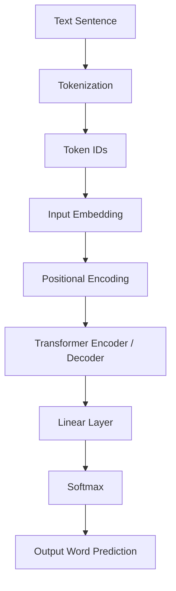
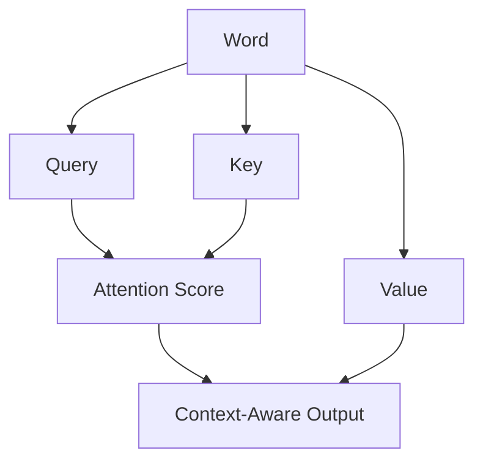
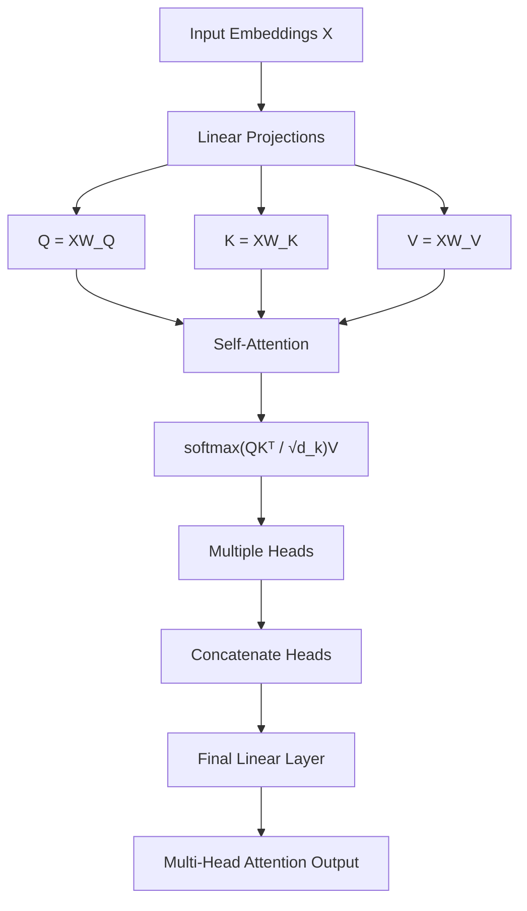

Modern AI systems like ChatGPT, Google Translate, and GPT models are all powered by a revolutionary architecture: **Transformers**.

But before Transformers, models like RNNs and LSTMs struggled with long sentences, slow training, and memory limitations. Transformers solved these problems using a powerful idea called **Self-Attention**.

### The Famous Paper
Transformers were introduced in the landmark 2017 paper **"Attention Is All You Need"** by researchers at Google. This architecture completely shifted the landscape of Natural Language Processing (NLP).

---

### Why Transformers? (RNN/LSTM vs. Transformer)

To understand why Transformers are so powerful, we first need to look at what they replaced. Traditional models like RNNs and LSTMs processed text one word at a time (sequentially), which led to several bottlenecks.

| Feature | RNN / LSTM | Transformer |
| :--- | :--- | :--- |
| **Processing Speed** | Sequential (Slow) | Parallel (Fast) |
| **Long Sentences** | Hard to remember context | Self-Attention connects all words |
| **Memory** | Compressed hidden state | Dynamic Attention scores |
| **Training** | Vanishing Gradients (Unstable) | Stable & Scalable |
| **Scalability** | Difficult to scale | Scales to huge datasets |

---

### Problems Solved by Transformers

#### 1. Processing Speed
RNNs process words one after another. If you have a sentence with 100 words, the model must wait for word 1 to finish before moving to word 2. 
**The Solution:** Transformers process all words in a sequence **at the same time** using attention matrices. This parallel processing makes training much faster.

#### 2. Long-Range Dependency (The Context Problem)
In a long sentence, traditional models often "forget" the beginning by the time they reach the end.
*   **Example:** *"The book that I bought yesterday from the new store is amazing."*
*   **The Issue:** An RNN might lose the connection between "book" and "amazing." 
*   **The Solution:** Transformers use Self-Attention to allow every word to "look at" every other word directly. The model understands that **"book"** is the thing that is **"amazing."**

#### 3. Memory Bottleneck
RNNs try to compress an entire sentence into a single "hidden state" vector. This means important details can easily be lost in the compression.
**The Solution:** Transformers don't compress everything into one state. Instead, they use attention scores to dynamically focus on relevant words for the current task.

#### 4. Training Instability
RNNs suffer from vanishing and exploding gradients, making them hard to train on very long sequences.
**The Solution:** Transformers remove recurrence completely and rely on attention and feed-forward layers, making training significantly more stable.

---
### The Transformer Pipeline: From Text to Prediction

Before we dive into the math, let's look at the high-level process of how a Transformer handles a sentence:




*Figure 1: The Transformer - model architecture.*

---

### Tokenization in Transformers
{: .technical-heading }

**What is Tokenization?**
Tokenization is the process of breaking raw text into smaller units called **tokens** so that a machine learning model can process them. Computers cannot directly understand words or sentences—they work with numbers. Therefore, text must first be split and converted into tokens.

*   **Example Sentence:** *"Transformers are powerful models"*
*   **After Tokenization:** `["Transformers", "are", "powerful", "models"]`

Each token is then converted into numerical IDs from the model's vocabulary.

**Why Tokenization is Important**
1.  **Neural networks cannot read raw text:** They require numerical input.
2.  **Language Structure:** It helps the model understand the building blocks of a sentence.
3.  **Efficiency:** It allows models like BERT and GPT to process vast amounts of text efficiently.

**Example of the Process:**
*   **Sentence:** *"I love machine learning"*
*   **Step 1 — Tokenization:** `["I", "love", "machine", "learning"]`
*   **Step 2 — Token IDs:** `[17, 235, 984, 652]`

---

#### 1️⃣ Tokenization (From Scratch)

A simple tokenizer splits a sentence into words.

```python
def tokenize(sentence):
    tokens = sentence.lower().split()
    return tokens

text = "Transformers are powerful models"

tokens = tokenize(text)
print(tokens)
```

**Output:**
```python
['transformers', 'are', 'powerful', 'models']
```

This simple tokenizer splits text into tokens using spaces. Real NLP models use more advanced tokenization techniques like subword tokenization.

---

#### 2️⃣ Convert Tokens to Token IDs

Models cannot process words directly, so we convert them into numbers.

```python
vocab = {
    "transformers": 1,
    "are": 2,
    "powerful": 3,
    "models": 4
}

tokens = ["transformers", "are", "powerful", "models"]

token_ids = [vocab[token] for token in tokens]

print(token_ids)
```

**Output:**
```python
[1, 2, 3, 4]
```

---

**Code Block 1 — Tokenization**

Example using the Hugging Face Transformers tokenizer.

```python
from transformers import AutoTokenizer

tokenizer = AutoTokenizer.from_pretrained("bert-base-uncased")

text = "Transformers are powerful models"

tokens = tokenizer.tokenize(text)
print(tokens)
```

**Output:**
```python
['transformers', 'are', 'powerful', 'models']
```

**Code Block 2 — Convert Tokens to IDs**

```python
token_ids = tokenizer.convert_tokens_to_ids(tokens)

print(token_ids)
```

**Example output:**
```python
[19081, 2024, 3928, 4275]
```

This shows how words become numbers.

---

### Input Embedding in Transformers
{: .technical-heading }

**What is Input Embedding?**
Input Embedding is the process of converting token IDs into **dense numerical vectors** so that the Transformer model can understand the meaning of words. After tokenization, words become numbers (token IDs), but neural networks work much better with vectors that capture semantic relationships.

**Example Process ("I love AI"):**
1.  **Tokenization:** `["I", "love", "AI"]`
2.  **Token IDs:** `[15, 289, 910]`
3.  **Input Embedding:** Each ID is converted into a high-dimensional vector.

| Token | Token ID | Embedding Vector (Simplified) |
| :--- | :--- | :--- |
| **I** | 15 | `[0.12, -0.44, 0.81, ...]` |
| **love** | 289 | `[0.65, 0.13, -0.72, ...]` |
| **AI** | 910 | `[-0.22, 0.91, 0.34, ...]` |

In real models, these vectors can have dimensions like **512, 768, 1024, or even 4096+**.

---

#### 3️⃣ Input Embedding (From Scratch)

We convert token IDs into vectors.

```python
import numpy as np

vocab_size = 10
embedding_dim = 4

embedding_matrix = np.random.rand(vocab_size, embedding_dim)

token_ids = [1, 2, 3]

embeddings = embedding_matrix[token_ids]

print(embeddings)
```

This creates vector representations for tokens.

---

**Code Block 3 — Embedding Representation**

Example using PyTorch.

```python
import torch
import torch.nn as nn

embedding = nn.Embedding(num_embeddings=10000, embedding_dim=512)

token_ids = torch.tensor([15, 289, 910])

vectors = embedding(token_ids)

print(vectors.shape)
```

**Output:**
```python
torch.Size([3, 512])
```

This means 3 tokens → 512-dimension vectors.

**Why Input Embedding is Important**
Input embeddings allow the model to capture **semantic relationships** between words. A famous example is:
> **king − man + woman ≈ queen**

Words with similar meanings (like "dog" and "puppy" or "car" and "vehicle") will have vectors that are numerically "close" to each other in this high-dimensional space.

**The Embedding Matrix**
The model uses a massive **Embedding Matrix** (e.g., 50,000 words × 512 dimensions). When a token ID enters the layer, the model simply looks up the corresponding row in this matrix to get its vector.

**Input Embedding + Positional Encoding**
Because Transformers process all words at once (in parallel), they naturally don't know the order of words. To fix this, the model adds **Positional Encoding** to the Input Embedding:
> **Final Input = Token Embedding + Positional Encoding**

This gives the model both the **meaning** of the word and its **position** in the sentence.

---

### Positional Encoding in Transformers
{: .technical-heading }

**What is Positional Encoding?**
Positional Encoding is a technique used in Transformers to add information about the **position** of each word in a sentence. Because Transformers process all words at the same time (in parallel), the model does not naturally know the order of words. 

Positional encoding tells the model:
*   Which word comes first
*   Which word comes second
*   The relative distance between words

**Why Positional Encoding is Needed**
Consider these two sentences:
1.  *"man walks on river bank"*
2.  *"man withdraws money from bank"*

Both sentences contain the same words, but the meaning is completely different. Without positional information, a Transformer would treat them almost the same (like a "bag of words"). Positional encoding solves this by adding specific position information to the word embeddings.

**How it Works: The Sinusoidal Approach**
The original Transformer paper used **sinusoidal (wave-like) functions** to generate unique position values. This allows the model to learn relative distances between words and handle sequences longer than those seen during training.

**The Simple Calculation:**
> **Final Input Vector = Word Embedding Vector + Positional Encoding Vector**

---

#### 4️⃣ Positional Encoding (Simplified)

Add position information to embeddings.

```python
import numpy as np

def positional_encoding(length, d_model):
    pos_encoding = np.zeros((length, d_model))

    for pos in range(length):
        for i in range(d_model):
            pos_encoding[pos][i] = pos / (10000 ** (2*i/d_model))

    return pos_encoding

encoding = positional_encoding(5, 4)
print(encoding)
```

This gives each word a unique position vector.

---

**Code Block: PyTorch Positional Encoding**

Example using PyTorch.

```python
import torch
import math

def positional_encoding(seq_len, d_model):
    pe = torch.zeros(seq_len, d_model)

    for pos in range(seq_len):
        for i in range(0, d_model, 2):
            pe[pos, i] = math.sin(pos / (10000 ** ((2*i)/d_model)))
            pe[pos, i+1] = math.cos(pos / (10000 ** ((2*(i+1))/d_model)))

    return pe


seq_len = 5
d_model = 512

pe = positional_encoding(seq_len, d_model)

print(pe.shape)
```

**Output:**
```python
torch.Size([5, 512])
```

---

*   **Example Process ("I love AI"):**
    *   **"I"** → Word Embedding `[0.2, 0.1, 0.7]` + Position 1 Vector `[0.01, 0.02, 0.03]`
    *   **"love"** → Word Embedding `[0.8, 0.4, 0.3]` + Position 2 Vector `[0.04, 0.05, 0.06]`
    *   **"AI"** → Word Embedding `[0.6, 0.9, 0.5]` + Position 3 Vector `[0.07, 0.08, 0.09]`

This allows the model to know both the **meaning** (from the embedding) and the **location** (from the encoding) of every word.

---

### Deep Dive: How Self-Attention Works
{: .technical-heading }

Self-Attention is the mechanism that allows a model to analyze the relationship between words in a sequence. Think of it as a way for each word to ask: *"How much attention should I give to every other word to understand my own context?"*

#### Why Self-Attention is Powerful
Based on the core principles of Transformers, Self-Attention provides three main advantages:
*   **Captures Long-Range Relationships:** Unlike RNNs, distance between words doesn't matter. Every word can "see" every other word instantly.
*   **Parallel Processing:** All words are processed simultaneously, making the model incredibly fast to train.
*   **Better Context Understanding:** The model can disambiguate words based on their surroundings.

#### The Q, K, V Formula
Every word is converted into three distinct vectors:
*   **Query (Q):** What the word is searching for ("I am word X, searching for related info").
*   **Key (K):** What the word represents to others ("I am word Y, here is my label").
*   **Value (V):** The actual information carried by the word ("I am word Y, here is my content").

**A Simple Analogy:**
> **"queen selects king to get more value"**
> The Query (Queen) looks for a matching Key (King) to get the most relevant information (Value).

**The process is simple:**
1.  **Query × Key** → **Attention Score** (The model compares these to see how words relate).
2.  Then, it uses the **Score** to **combine the Value vectors**.
3.  This produces the **context-aware representation** of the word.

> **Definition:** Self-Attention is a mechanism that allows each word in a sequence to analyze and weight its relationship with every other word, enabling the model to understand context and meaning efficiently.

---

#### 5️⃣ Self-Attention (Simple Scratch Code)

This shows the core attention calculation. In real transformers, Q, K, and V are created by multiplying the input embeddings with learned weight matrices.

```python
import numpy as np

# Input Embeddings (X)
X = np.random.rand(3, 4)

# Learned Weight Matrices
WQ = np.random.rand(4, 4)
WK = np.random.rand(4, 4)
WV = np.random.rand(4, 4)

# Projected Q, K, V
Q = np.dot(X, WQ)
K = np.dot(X, WK)
V = np.dot(X, WV)

# Similarity Score (Scaled Dot-Product)
dk = K.shape[-1]
scores = np.dot(Q, K.T) / np.sqrt(dk)

weights = np.exp(scores) / np.sum(np.exp(scores), axis=1, keepdims=True)

output = np.dot(weights, V)

print(output)
```

This demonstrates:
**Attention(Q,K,V) = softmax(QKᵀ / √dk)V**

---

**Code Block 4 — Simple Self-Attention Example**

Example using PyTorch.

```python
import torch
import math

Q = torch.rand(3, 4)
K = torch.rand(3, 4)
V = torch.rand(3, 4)

dk = K.size(-1)
attention_scores = torch.matmul(Q, K.T) / math.sqrt(dk)

attention_weights = torch.softmax(attention_scores, dim=-1)

output = torch.matmul(attention_weights, V)

print(output)
```

This demonstrates basic self-attention computation.


#### A Visual Example: "The cat sat on the mat"
When the model analyzes the sentence, it assigns scores based on relevance. For the word **"sat,"** the attention might look like this:

| Word | Attention Score |
| :--- | :--- |
| **The** | 0.05 |
| **cat** | 0.40 |
| **sat** | 0.30 |
| **on** | 0.15 |
| **the** | 0.10 |
| **mat** | 0.10 |

In this case, the word **"sat"** focuses most on **"cat"** (the subject) and **"sat"** itself, helping the model understand the action and who performed it.


---

### Multi-Head Attention: Learning Multiple Relationships
{: .technical-heading }

**The technical steps are:**
1.  **Similarity Score ($QK^T$):** This calculates how much each word relates to every other word in the sequence.
2.  **Scaling ($\frac{1}{\sqrt{d_k}}$):** To stabilize training and prevent gradients from vanishing or exploding, the scores are divided by the square root of the dimension of the key vectors ($d_k$).
3.  **Softmax:** Converts the scaled scores into probabilities (Attention Weights), ensuring they sum to 1.
4.  **Weighted Sum:** Multiplies the weights by the **Value (V)** vectors to produce the final **context-aware representation** of each token.

While Self-Attention allows a model to look at other words, it only learns **one** type of relationship at a time. However, language is complex and contains many types of relationships simultaneously:
*   **Pronoun references** (Which word does "it" refer to?)
*   **Sentence structure** (Subject-Verb relationship)
*   **Long-distance dependencies** (Connecting words far apart)

To solve this, Transformers use **Multi-Head Attention**—running multiple self-attention operations in parallel and then combining their outputs.

#### A Linguistic Example:
*"The animal didn't cross the street because it was tired."*

Different attention "heads" may focus on different aspects:
*   **Head 1:** Might focus on **pronoun references**, connecting "it" to "animal."
*   **Head 2:** Might focus on the **sentence structure**, connecting "cross" to "street."
*   **Head 3:** Might focus on the **reasoning**, connecting "tired" to "animal."

By using multiple heads, the model understands richer linguistic patterns.

#### The 4-Step Process of Multi-Head Attention

**Step 0: Input Embeddings**
Each token starts as an embedding vector.
*   *Example:* 3 tokens → Embedding dimension 512.

**Step 1: Create Q, K, V for Each Head**
For each token embedding ($X$), the model creates Query, Key, and Value vectors using learnable weight matrices ($W^Q, W^K, W^V$). These weights are updated as the model trains.
*   $Q = XW^Q$
*   $K = XW^K$
*   $V = XW^V$

**Step 2: Compute Self-Attention for Each Head**
Each head calculates its own attention scores independently using the standard formula:
> **$Attention(Q,K,V) = \text{softmax}\left(\frac{QK^T}{\sqrt{d_k}}\right)V$**

**Step 3: Concatenate All Heads**
The outputs from all attention heads are concatenated (joined together) to combine the different information they gathered.
*   $Concat(Head_1, Head_2, ...)$

**Step 4: Final Linear Layer**
The concatenated result passes through a final linear projection ($W^O$) to produce the final output that the rest of the Transformer can use.
> **$MultiHead(Q,K,V) = Concat(Head_1, ..., Head_H)W^O$**



In multi-head attention, the input embeddings are projected into queries, keys, and values using learned weight matrices, and multiple self-attention operations are computed in parallel to capture different relationships between tokens.

---

### Transformers in Action

**Code Block 5 — Loading a Transformer Model**

Example using BERT.

```python
from transformers import pipeline

classifier = pipeline("sentiment-analysis")

result = classifier("Transformers are amazing for NLP!")

print(result)
```

**Output:**
```python
[{'label': 'POSITIVE', 'score': 0.99}]
```
